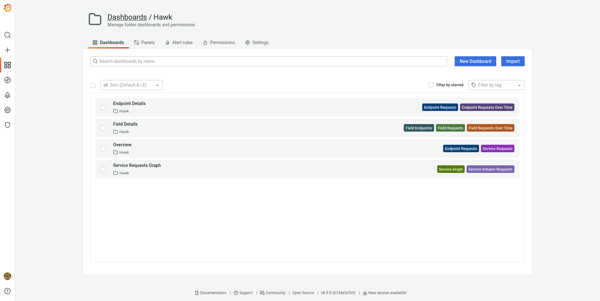
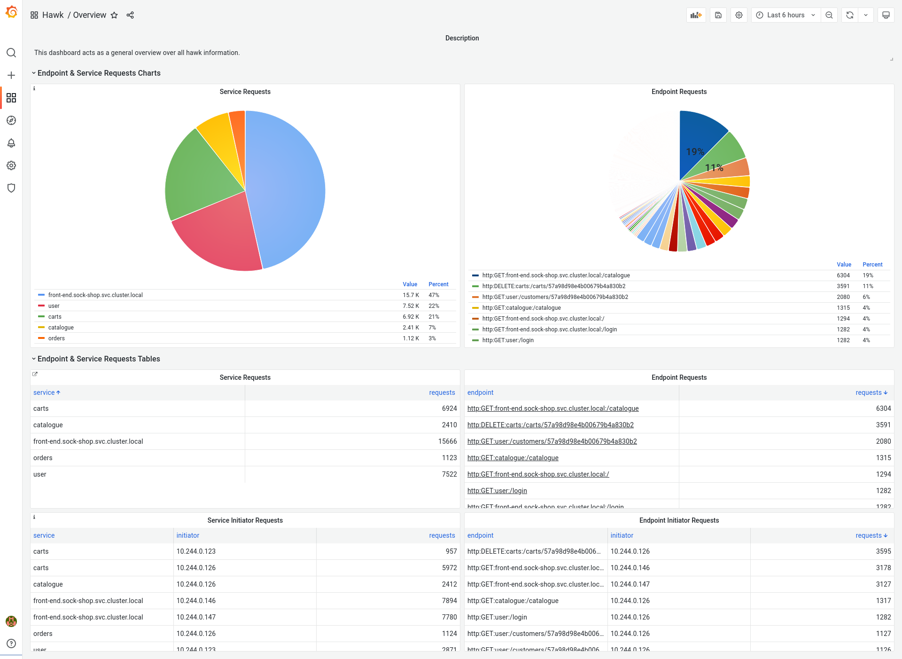
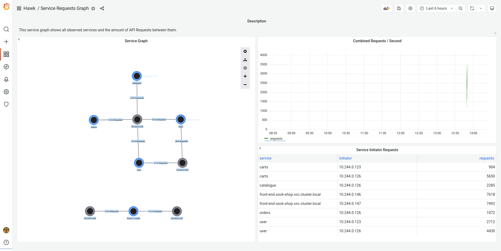
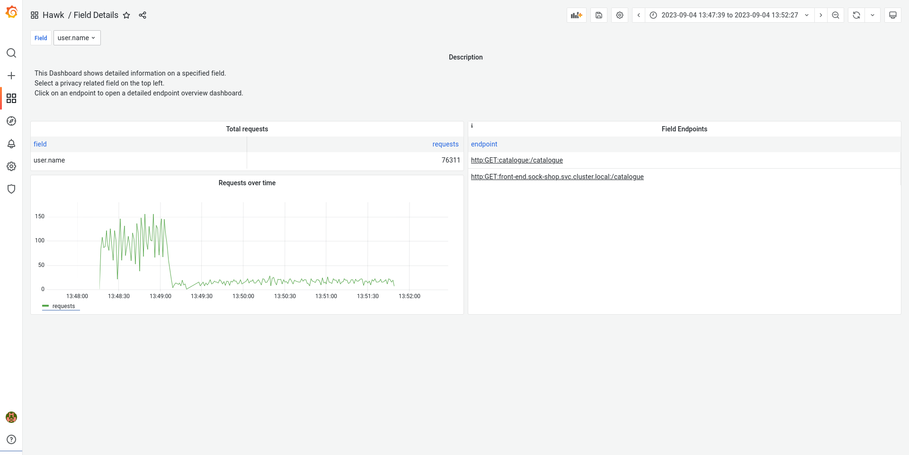
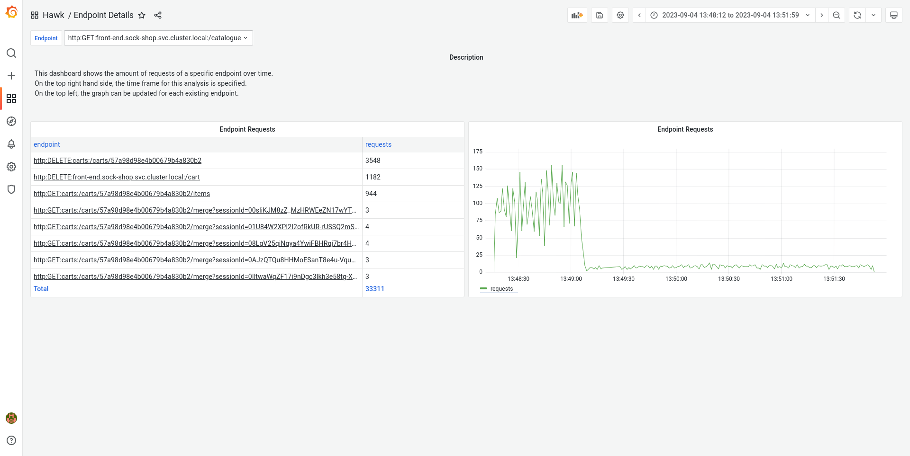

# Hawk Grafana Monitor

The Hawk grafana dashboards enable capable privacy insights.

We provide four dashboards in the hawk directory:
- Dashboard
- Service Graph
- Field Details
- Endpoint Details

## Dashboard screenshots
### Overview
This dashboard acts as a general overview over all hawk information.

### Service Graph
This service graph shows all observed services and the amount of API Requests between them.

### Field Details
This Dashboard shows detailed information on a specified field.
Select a privacy related field on the top left.
Click on an endpoint to open a detailed endpoint overview dashboard.

### Endpoints Details
This dashboard shows the amount of requests of a specific endpoint over time.
On the top right hand side, the time frame for this analysis is specified.
On the top left, the graph can be updated for each existing endpoint.
